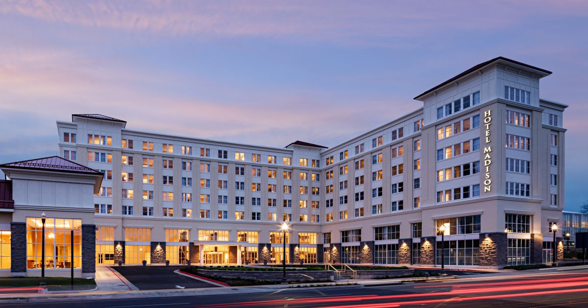

# Hotel Database

 <small>Image source:
[hotelmadison.com](https://www.hotelmadison.com/)
</small>

## Data Requirements

The database for a hotel chain which has hotels all over the world.

#### Hotels

- Each individual hotel has a unique id, a name, an address, and multiple phone numbers.
- A hotel also has multiple features, for example: a pool, conference facilities, a spa, restaurants, etc.

#### Rooms

- Each hotel has its own set of room types, e.g.: single, double, suite, penthouse, etc.  A room type has a size (in sq. meters), a capacity (max # of people), and multiple room features.  Room types are specific to a single hotel.
That means that even if two hotels have "single" rooms, those "single" rooms are different in each hotel (e.g., different in size, view, furnishings).
- Each individual room in a hotel has a room number, a floor (even if the floor is part of the room number, because people sometimes want or do not want a specific floor), and belongs to a single room type.

#### Guests and occupants

- The hotel chain keeps track of guests. Each guest has a unique guest id, also an identification type and number (e.g. US passport and number, or driving license and number), an address and a home phone number, and a mobile phone number.
- A guest may hold one or more reservations for specific room type(s) in a specific hotel from a check-in to check-out date.
- A guest may be currently occupying one or more specific rooms.
- A guest is the person who pays, but their family members or friends may be occupying the room(s) that are assigned to the one guest.
- For security reasons, the hotel must know at least the names of all the people occupying a room, and who has occupied that room in the past.
- Guests may belong to certain guest categories (e.g., VIP, government, military, etc.) that give them a discount.

#### Room prices

- Assume the price of a room is not fixed, but instead it depends on the day of the week and the season.
- There are numerous seasons, which depend on the location (*and policies*) of hotel, for example: winter, winter holiday, beach season, etc.
- Each season has a name, and a start and end date.
- Seasons are unique to a hotel.
- A bill should be able to be generated for a guest on the day that they check out of the hotel.
- A guest's record of stays and billing history should be saved in the database, so that advertising can be sent to guests based on how much money they have spent at a hotel, and at the whole chain.

#### Services

- Items or services that a guest can be charged for during their stay and will be added to the bill.
- Some examples might be breakfast, spa services, snacks in the room, restaurant or room service, ordering movies, etc.

## Example Scenarios

#### Scenario 1
On June 1, Mr. X makes a reservation in the hotel "Fun" for 2 rooms for 3 nights, June 9--12.
One room is a "double" for Mr. and Mrs. X and their 2 children.
The second room is a "single river view" for Mrs. X's parents.
When the family arrives on June 9, they are assigned rooms 110 and 212.
When they checkout, on June 12, they get the bill, for $890:

|                   | Thursday       | Friday          | Saturday        | Total   |
|-------------------|----------------|-----------------|-----------------|---------|
| Room              | Summer – Jun 9 | Summer – Jun 10 | Summer – Jun 11 |         |
| double            | $ 135          | $ 150           | $ 175           | $ 460   |
| single river view | $ 110          | $ 140           | $ 180           | $ 430   |

#### Scenario 2
On Sep 1, Mr. X makes a reservation in the hotel "Tall" for 1 room for a business trip for 1 night on Sep 22.
Hotel "Tall" has similar seasons to hotel "Fun", so it is still "Summer" season until September 30.
He requests a room of type "single suite".
He pays in advance online, the rate for a single suite on a Monday in summer, which is $99.
When he checks in on September 22, they assign him room 14101.
He is very superstitious and is afraid of the number 13, so he asks them, "Is room 14101 really on the 13th floor?"
The desk clerk admits, "Yes, we don't have a 13th floor, so the 14th is really the 13th."
So, the desk clerk changes him to room 7103.
When Mr. X goes up to his room, 7103, he is shocked to find that it smells like cigarette smoke, and he is allergic.
So he goes back down to the hotel desk.
The clerk apologizes and gives him a new room, room 20118, which is on the top floor with a great view, so Mr. X is finally happy.

It is a strange fact that some people are so afraid of the number 13, that some buildings do not have a 13th floor.
The floors are just numbered ... 9, 10, 11, 12, 14, 15, 16, ...
This will make people who just don't like the number 13 on their room comfortable.
But some people, like Mr. X, take it more seriously.