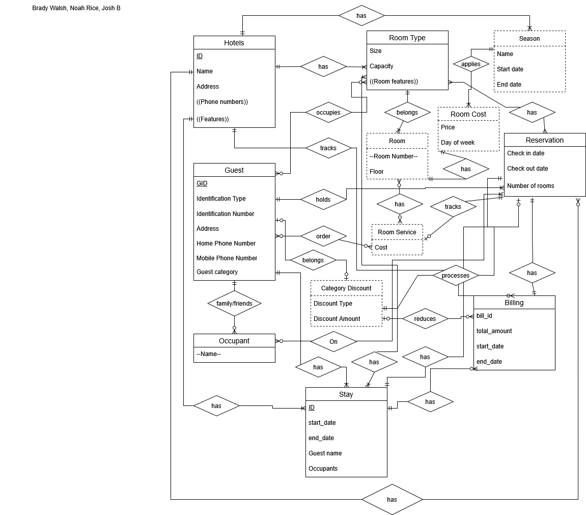
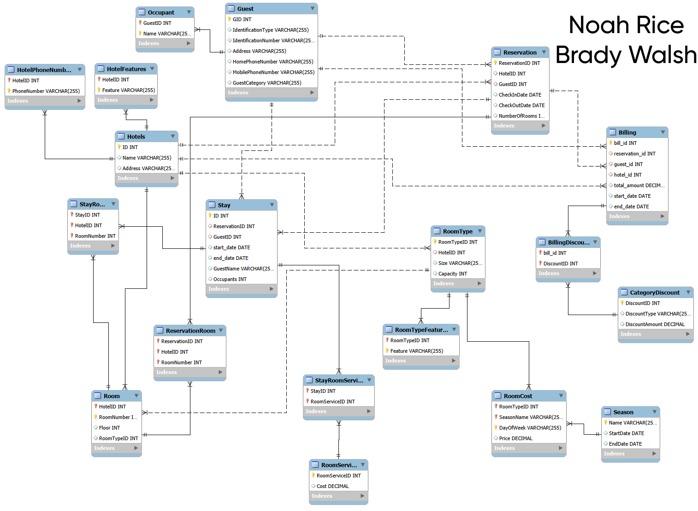
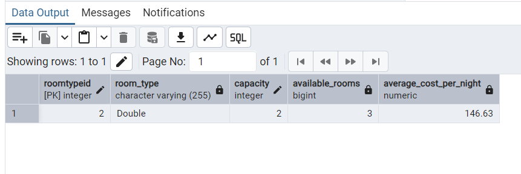
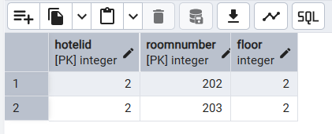
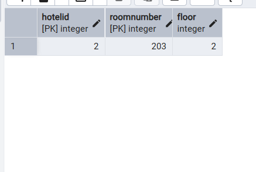
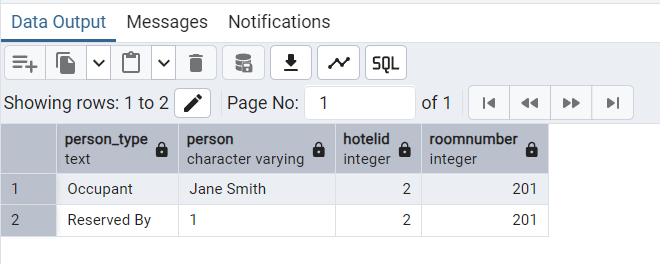
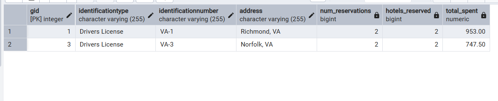

# CS374 Hotel Database Final Report
*Brady Walsh, Noah Rice, Joshua Browning*

## ER Model

*Describe any changes since HW7*

## Relational Model

*Describe any changes since HW7*

## Database creation

- Drop tables: [drop.sql](./database/drop.sql)
- Create tables: [create.sql](./database/create.sql)
- Add constraints to tables: [alter.sql](./database/alter.sql)

*Describe any changes very briefly: for example:*

## Data

- Add some data: [hw8load.sql](./data/hw8load.sql) and [query2-3load.sql](./data/query2-3load.sql) and 

*Describe any changes very briefly: for example:*

## Queries

### Query 1

[query1.sql](./queries/query1.sql)

Setup:

Before this query runs, extra rows need to be added beyond what is already there. Hotel 1 needs pricing for the requested stay dates from 7/15/2027 to 7/17/2027/ The added data makes also single rooms at Hotel 1 unavailable during those dates so that at least one room type is unavailable. the prices are different across the two nights because one night is Thursday vs Friday.

SELECT:

This lists the room types at Hotel 1 that are available for the requested stay. The query checks rooms against existing reservations using a NOT EXISTS query. If a room already has an overlapping reservation, then that room is excluded. The query then groups by room type and calcuates average cost per night.

INSERT:

The insert statements add the new VIP guest, create a reservation for that guest, and assign the guest to an available room. These inserts are done together since they all depend on one another. The new reservation is for Hotel 1 from 7/15/2027 to 7/17/2027, and the assigned room is one of the available double rooms.

<!--  -->

### Query 2
[query2.sql](./queries/query2.sql)

Setup:

Before this query runs, you need extra rows beyond what hw8load2.sql provides. Specifically, we need Mrs. Smith's guest record and her reservation and a an occupied Double at Hotel 2. You would first run quer2-3load.sql first then quer2.sql.

SELECT:

This lists Doubles at Hotel 2 that are not occupuied. The NOT EXISTS subquery helps here by seeing if the room is in any current stay record. If it is then it is excluded. Reservations on their own do not disqualify a certain room the specific stay of checking in physically does. The picture below shows the two rooms in hotel 2 that are Doubles and are not occupied. 

INSERT:

Mr.Smith is added as an occupant under Guest 11. The ReservationRoom binds the reservation 13 to room 202. It opens stay 5 from 4/30/2026 to 5/2/26 with 2 occupants on Room 202 which makes it occupied. The StayRoom links the stay to the specific room. This second image below shows that the room is now occupied by Mr. and Mrs. Smith.

### Query 3
[query3.sql](./queries/query3.sql)

*Describe the queries in detail with screenshots of setup and results*

### Query 4
[query4.sql](./queries/query4.sql)

Setup:

Before this query runs, the database needs to have a stay connected to a specific room through StayRoom, and that stay needs to have at least two people connected to it. In this case, the selected room has Mr. and Mrs. Smith connected to the stay, so the query can return both the person who reserved the room and at least one occupant.

SELECT:

This query finds the people connected to a specific room on a specific date. It uses Stay and StayRoom to find which stay was assigned to that room. The date condition checks that the selected date falls within the stay's start and end dates. Then the query uses the guest ID from the stay to find the occupant names connected to that guest. The screenshot below shows the people connected to the selected room on that date.

<!--  -->

### Query 5
[query5.sql](./queries/query5.sql)

SETUP:

We do not need to insert any more columns because we have guests with 2+ reservations across 2+ different hotels.
The Billing row is also already loaded (Bills 1, 2, totaling $953, $747.50) attach to these same guests, 
so the spend column will populate.

The structure of this query has 4 steps:

params - Sets the dates frame from 6/15/2025 - 6/14/2026

guest_reservations - Only picks guests reservations and counts
the distinct hotels per guest in the window of dates. 

qualifying_guests - Only allows guests with at least 2 reservations and at least 2 distinc hotels within the time frame.

guest_billing - It separately takes the sum of each guest's total spending from the Billing table. There is a left join at the end because a guest can qualify on reservations even if they have not been billed yet.

The SELECT query gets the identification type, id num, address, number of reservations, hotels reserved and total spend. The results shown below show two guests who fall within the year range and are qualifying. It also shows the total they spent on their reservations.

